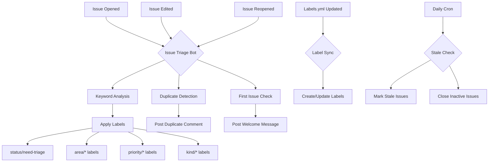

# Issue Triage System - Architecture Overview

Visual overview of the automated issue triage system architecture and workflows.

## System Architecture

```
┌─────────────────────────────────────────────────────────────────┐
│                     GitHub Repository                            │
├─────────────────────────────────────────────────────────────────┤
│                                                                  │
│  ┌────────────────┐      ┌──────────────┐     ┌──────────────┐ │
│  │  User Opens    │─────▶│  GitHub      │────▶│  Issue       │ │
│  │  New Issue     │      │  Actions     │     │  Created     │ │
│  └────────────────┘      └──────────────┘     └──────┬───────┘ │
│                                                       │         │
│                              Triggers                 │         │
│                                  │                    │         │
│                                  ▼                    │         │
│                    ┌──────────────────────────┐      │         │
│                    │  Issue Triage Workflow   │      │         │
│                    │  (issue-triage.yml)      │      │         │
│                    └────────────┬─────────────┘      │         │
│                                 │                     │         │
│                    ┌────────────┼─────────────┐      │         │
│                    │            │             │      │         │
│                    ▼            ▼             ▼      │         │
│            ┌──────────┐  ┌──────────┐  ┌──────────┐│         │
│            │ Keyword  │  │ TF-IDF   │  │  First   ││         │
│            │ Analysis │  │ Duplicate│  │  Issue   ││         │
│            │          │  │ Detection│  │  Check   ││         │
│            └────┬─────┘  └────┬─────┘  └────┬─────┘│         │
│                 │             │             │      │         │
│                 └─────────────┼─────────────┘      │         │
│                               │                     │         │
│                               ▼                     ▼         │
│                    ┌──────────────────┐    ┌────────────────┐│
│                    │  Apply Labels    │    │ Post Comments  ││
│                    │  - area/*        │    │ - Welcome      ││
│                    │  - priority/*    │    │ - Duplicates   ││
│                    │  - kind/*        │    │ - Need info    ││
│                    │  - status/*      │    └────────────────┘│
│                    └──────────────────┘                      │
│                                                               │
│  ┌─────────────────────────────────────────────────────────┐ │
│  │              Parallel Automation                         │ │
│  ├─────────────────────────────────────────────────────────┤ │
│  │                                                           │ │
│  │  ┌─────────────────┐     ┌─────────────────┐           │ │
│  │  │ Label Sync      │     │ Project         │           │ │
│  │  │ (label-sync)    │     │ Automation      │           │ │
│  │  │                 │     │                 │           │ │
│  │  │ - Sync labels   │     │ - Auto-assign   │           │ │
│  │  │   from config   │     │ - Stale check   │           │ │
│  │  │ - Update colors │     │ - Need info     │           │ │
│  │  └─────────────────┘     └─────────────────┘           │ │
│  │                                                           │ │
│  └─────────────────────────────────────────────────────────┘ │
│                                                               │
│  ┌─────────────────────────────────────────────────────────┐ │
│  │              Maintainer Review                           │ │
│  ├─────────────────────────────────────────────────────────┤ │
│  │                                                           │ │
│  │  1. Verify bot labels                                    │ │
│  │  2. Check duplicate flags                                │ │
│  │  3. Prioritize critical issues                           │ │
│  │  4. Assign to team members                               │ │
│  │  5. Mark as triaged                                      │ │
│  │                                                           │ │
│  └─────────────────────────────────────────────────────────┘ │
│                                                               │
└─────────────────────────────────────────────────────────────────┘
```

## Workflow Triggers



## Data Flow

### Input Sources

1. **Issue Content**
   - Title
   - Body text
   - Template fields
   - User metadata

2. **Configuration**
   - labels.yml
   - Workflow configs
   - Keyword dictionaries
   - Bot templates

3. **Repository Context**
   - Existing issues
   - Historical labels
   - Team assignments

### Processing Stages

#### Stage 1: Content Analysis
```
Issue Content
    ↓
Tokenization & Normalization
    ↓
Keyword Matching
    ↓
Label Candidates
```

#### Stage 2: Duplicate Detection
```
Issue Content
    ↓
TF-IDF Vectorization
    ↓
Similarity Calculation
    ↓
Threshold Filter (>30%)
    ↓
Ranked Duplicates
```

#### Stage 3: Label Application
```
Label Candidates
    ↓
Deduplication
    ↓
Validation
    ↓
GitHub API Call
    ↓
Labels Applied
```

### Output Actions

1. **Labels Applied**
   - Minimum: status, kind, priority, area
   - Maximum: All applicable labels

2. **Comments Posted**
   - Welcome (first-time contributors)
   - Duplicates (if similarity >30%)
   - Need info (incomplete reports)

3. **Assignments Made**
   - Based on area labels
   - Team member availability

## Components

### Workflows

| File | Trigger | Purpose | Frequency |
|------|---------|---------|-----------|
| `issue-triage.yml` | Issue opened/edited | Auto-label & duplicate detection | On event |
| `label-sync.yml` | Labels config change | Sync label definitions | On push |
| `project-automation.yml` | Schedule + events | Stale check, auto-assign | Daily + events |

### Templates

| File | Purpose | Used By |
|------|---------|---------|
| `bug_report.yml` | Standardize bug reports | Users |
| `feature_request.yml` | Standardize feature requests | Users |
| `documentation.yml` | Standardize doc improvements | Users |
| `config.yml` | Template configuration | GitHub |

### Bot Templates

| File | Purpose | Trigger |
|------|---------|---------|
| `duplicate-detected.md` | Notify about similar issues | Similarity >30% |
| `welcome-first-issue.md` | Greet new contributors | First issue |
| `needs-more-info.md` | Request details | Incomplete report |
| `stale-issue.md` | Warn about closure | 60 days inactive |
| `resolved-closing.md` | Confirm resolution | Manual close |

### Configuration

| File | Purpose | Format |
|------|---------|--------|
| `labels.yml` | Label definitions | YAML |
| `setup-labels.sh` | Bootstrap script | Bash |

### Documentation

| File | Audience | Content |
|------|----------|---------|
| `README.md` | All users | Overview & quick start |
| `TRIAGE_PROCESS.md` | Contributors & maintainers | Complete triage documentation |
| `MAINTAINER_GUIDE.md` | Maintainers | Quick reference |
| `DEPLOYMENT_GUIDE.md` | Admins | Setup instructions |
| `SYSTEM_OVERVIEW.md` | Technical audience | Architecture details |

## Label Taxonomy

```
Labels
├── status/*          (Workflow state)
│   ├── need-triage
│   ├── triaged
│   ├── bot-triaged
│   ├── possible-duplicate
│   ├── blocked
│   ├── in-progress
│   ├── needs-info
│   └── wontfix
│
├── area/*           (Component/Feature)
│   ├── frontend
│   ├── backend
│   ├── design
│   ├── seo
│   ├── devops
│   ├── performance
│   ├── accessibility
│   ├── testing
│   ├── documentation
│   └── security
│
├── priority/*       (Severity)
│   ├── p0          (Critical)
│   ├── p1          (High)
│   ├── p2          (Medium)
│   └── p3          (Low)
│
└── kind/*           (Issue type)
    ├── bug
    ├── enhancement
    ├── documentation
    ├── question
    ├── chore
    └── regression
```

## Algorithms

### Keyword Matching

```javascript
function detectLabels(text, labelConfig) {
  const detectedLabels = [];
  for (const [label, keywords] of Object.entries(labelConfig)) {
    for (const keyword of keywords) {
      if (text.toLowerCase().includes(keyword.toLowerCase())) {
        detectedLabels.push(label);
        break;
      }
    }
  }
  return detectedLabels;
}
```

### TF-IDF Similarity

```javascript
// 1. Build TF-IDF index
const tfidf = new TfIdf();
tfidf.addDocument(currentIssue);
existingIssues.forEach(issue => tfidf.addDocument(issue));

// 2. Calculate similarity scores
const similarities = [];
tfidf.tfidfs(currentIssue.split(' '), (docIndex, measure) => {
  if (measure > threshold) {
    similarities.push({ issue: existingIssues[docIndex], score: measure });
  }
});

// 3. Sort by relevance
similarities.sort((a, b) => b.score - a.score);
```

## Performance Characteristics

### Execution Time

- **Keyword Analysis**: <1 second
- **Duplicate Detection**: 2-5 seconds (100 issues)
- **Label Application**: <1 second
- **Total Workflow**: 5-10 seconds typical

### Scalability

- **Issue Limit**: Checks last 100 issues for duplicates
- **Keyword Count**: 50+ keywords per category
- **Label Limit**: GitHub supports unlimited labels
- **Rate Limits**: GitHub Actions has 1000 API calls/hour

### Accuracy Targets

- **Auto-Labeling**: >90% accuracy
- **Duplicate Detection**: >60% recall, <10% false positive
- **Priority Assignment**: >80% accuracy
- **Area Detection**: >85% accuracy

## Integration Points

### GitHub API

```javascript
// Issue labels
github.rest.issues.addLabels()
github.rest.issues.removeLabel()

// Comments
github.rest.issues.createComment()

// Issue search
github.rest.issues.listForRepo()

// Assignments
github.rest.issues.addAssignees()
```

### External Dependencies

```json
{
  "natural": "TF-IDF and NLP",
  "compromise": "Text normalization",
  "@actions/core": "Workflow utilities",
  "@actions/github": "GitHub API client"
}
```

## Security Considerations

### Permissions

```yaml
permissions:
  issues: write        # Required for labeling
  contents: read       # Required for workflow access
  pull-requests: write # Optional for PR triage
```

### Secrets

- Uses `GITHUB_TOKEN` (auto-provided)
- No custom secrets required
- Token scoped to repository only

### Rate Limiting

- Actions: 1000 API calls/hour
- Duplicate check limited to 100 issues
- Stale check processes 100 items per run

## Monitoring & Metrics

### Key Metrics

```javascript
// Triage velocity
timeToTriage = issue.triaged_at - issue.created_at

// Bot accuracy
accuracy = correct_labels / total_labels

// Duplicate detection
recall = true_duplicates_found / total_duplicates
precision = true_duplicates_found / all_flagged_duplicates

// Issue throughput
velocity = closed_issues / time_period
```

### Health Checks

- Workflow success rate >95%
- Average triage time <24 hours
- Stale issue rate <5%
- False positive rate <10%

## Future Enhancements

### Planned Features

1. **Machine Learning Labels**
   - Train on historical data
   - Improve keyword detection
   - Predictive priority assignment

2. **Sentiment Analysis**
   - Detect urgent/frustrated reporters
   - Auto-escalate based on sentiment
   - Personalized responses

3. **Cross-Repository Duplicate Detection**
   - Check related repositories
   - Link to similar issues in other projects

4. **Automated Assignment**
   - Based on expertise areas
   - Workload balancing
   - Availability checking

5. **Issue Templates V2**
   - Dynamic fields based on issue type
   - Required screenshots for bugs
   - Automated reproduction steps

### Technical Debt

- [ ] Add unit tests for triage logic
- [ ] Implement caching for TF-IDF index
- [ ] Add retry logic for API failures
- [ ] Create metrics dashboard
- [ ] Implement A/B testing for keywords

## Resources

- [GitHub Actions Docs](https://docs.github.com/en/actions)
- [Natural NPM Package](https://www.npmjs.com/package/natural)
- [TF-IDF Algorithm](https://en.wikipedia.org/wiki/Tf%E2%80%93idf)
- [Gemini CLI Reference](https://github.com/google/generative-ai-cli)

---

**Last Updated**: 2026-01-18
**Architecture Version**: 1.0.0
