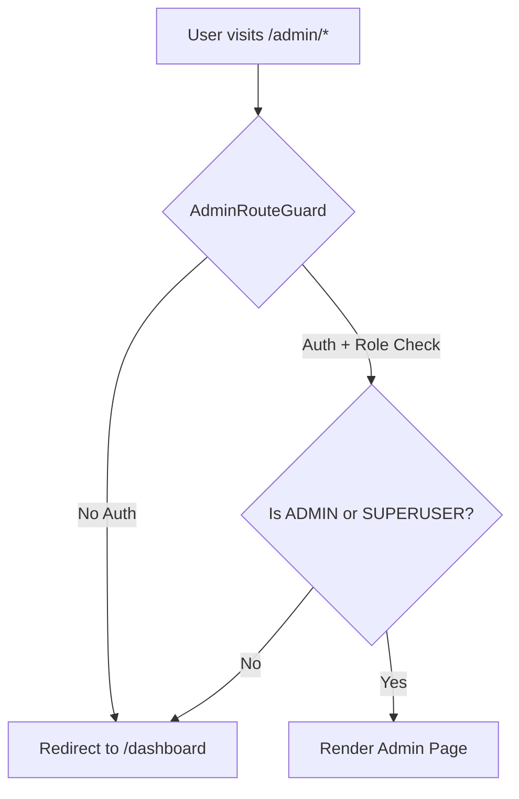

# Admin Dashboard Migration - Phase 1 Planning

**Issue**: #479
**Status**: Planning
**Priority**: Priority 1 Pages
**Created**: 2026-01-30

---

## Executive Summary

This document outlines the migration plan for the AINative Studio Admin Dashboard from a legacy Vite/React implementation to Next.js 16 App Router. Phase 1 focuses on the four highest-priority pages that are critical for admin operations.

---

## Current State Analysis

### Existing Implementation

The current Next.js staging codebase already has **partial admin functionality** implemented:

```
app/admin/
├── page.tsx (Dashboard Home) ✅ EXISTS
├── AdminDashboardClient.tsx ✅ EXISTS
├── users/
│   ├── page.tsx ✅ EXISTS
│   └── UsersClient.tsx ✅ EXISTS
├── monitoring/
│   ├── page.tsx ✅ EXISTS
│   └── MonitoringClient.tsx ✅ EXISTS
└── audit/
    ├── page.tsx ✅ EXISTS
    └── AuditClient.tsx ✅ EXISTS
```

### What's Already Working

1. **Admin Route Guard** (`components/guards/AdminRouteGuard.tsx`):
   - Client-side authentication check
   - Role-based access control (ADMIN, SUPERUSER)
   - Reads from localStorage `user` object
   - Redirects unauthorized users to `/dashboard`

2. **Admin Service** (`lib/admin-service.ts`):
   - Dashboard summary API
   - System health/metrics
   - User management
   - Audit logging
   - All endpoints prefixed with `/database/admin/`

3. **Dashboard Home** (`/admin`):
   - System health status
   - CPU/Memory/Disk metrics
   - Recent alerts
   - Quick action cards
   - Uses React Query for polling (30s for metrics, 15s for alerts)
   - Framer Motion animations

4. **Users Page** (`/admin/users`):
   - User listing with pagination
   - Search by email/name
   - Role filtering
   - Role management (update user roles)
   - Mock data fallback

### What's Missing for Phase 1

1. **Admin Login Page** (`/admin/login`):
   - ❌ NOT IMPLEMENTED
   - Regular login exists at `/login` but not admin-specific
   - Need dedicated admin login with role verification

2. **API Keys Management Page** (`/admin/api-keys`):
   - ❌ NOT IMPLEMENTED
   - API key service exists (`services/apiKeyService.ts`)
   - Need admin view for all user API keys

---

## Phase 1 Scope

### Priority 1 Pages (Must Have)

| Page | Route | Status | Complexity | Estimate |
|------|-------|--------|------------|----------|
| **Login** | `/admin/login` | ❌ Missing | Low | 4h |
| **Dashboard Home** | `/admin` | ✅ Complete | - | - |
| **Users** | `/admin/users` | ✅ Complete | - | - |
| **API Keys** | `/admin/api-keys` | ❌ Missing | Medium | 8h |

**Total Estimated Effort**: 12 hours

---

## Architecture Design

### Directory Structure

```
app/admin/
├── layout.tsx                    # ✅ EXISTS (needs review)
├── page.tsx                      # ✅ Dashboard Home (complete)
├── AdminDashboardClient.tsx      # ✅ Dashboard Client (complete)
│
├── login/
│   ├── page.tsx                  # ❌ TO CREATE
│   └── AdminLoginClient.tsx      # ❌ TO CREATE
│
├── users/
│   ├── page.tsx                  # ✅ EXISTS
│   └── UsersClient.tsx           # ✅ EXISTS
│
├── api-keys/
│   ├── page.tsx                  # ❌ TO CREATE
│   └── ApiKeysClient.tsx         # ❌ TO CREATE
│
├── monitoring/                   # ✅ EXISTS (bonus)
├── audit/                        # ✅ EXISTS (bonus)
└── analytics-verify/             # ✅ EXISTS (bonus)
```

### Shared Components (To Review/Create)

```
components/admin/
├── AdminSidebar.tsx              # ❌ TO CREATE
├── AdminHeader.tsx               # ❌ TO CREATE
├── AdminPageHeader.tsx           # ❌ TO CREATE
├── AdminStatsCard.tsx            # ❌ TO CREATE
└── AdminTable.tsx                # ❌ TO CREATE
```

---

## Page Specifications

### 1. Admin Login Page (`/admin/login`)

**Route**: `/admin/login`
**Status**: ❌ Missing
**Complexity**: Low

#### Requirements

- Separate from user login (`/login`)
- Admin-specific authentication
- Role verification (ADMIN or SUPERUSER only)
- Session management
- Redirect on success to `/admin`
- Error handling for non-admin users

#### Component Structure

```tsx
// app/admin/login/page.tsx
export default function AdminLoginPage() {
  return <AdminLoginClient />;
}

// app/admin/login/AdminLoginClient.tsx
'use client';
- Email/password form
- Admin role verification
- Error states
- Loading states
- Redirect logic
```

#### API Integration

- Uses existing `authService.login()`
- Validates `user.role` from response
- Stores admin session in localStorage
- Sets auth token in cookies

#### Design Considerations

- Dark theme (matches existing admin pages)
- Minimal branding
- Security-focused messaging
- Session timeout warnings

#### Dependencies

- `services/AuthService.ts` ✅ EXISTS
- `components/ui/input` ✅ EXISTS
- `components/ui/button` ✅ EXISTS
- `components/ui/alert` ✅ EXISTS

---

### 2. Dashboard Home (`/admin`)

**Route**: `/admin`
**Status**: ✅ COMPLETE
**Implementation**: Existing

#### Current Features

- System health overview
- CPU/Memory/Disk usage metrics
- Active alerts display
- User statistics
- Quick action cards
- Real-time polling (React Query)

#### No Changes Required

This page is production-ready. Uses:
- `AdminRouteGuard` for auth
- `adminService.getDashboardSummary()` for data
- Mock data fallback for development
- Responsive grid layout

---

### 3. Users Page (`/admin/users`)

**Route**: `/admin/users`
**Status**: ✅ COMPLETE
**Implementation**: Existing

#### Current Features

- User listing with pagination (50/page)
- Search by email/name
- Role filtering (all/user/admin/superuser)
- Role management (update user roles)
- Last login tracking
- User status indicators

#### No Changes Required

This page is production-ready. Uses:
- `adminService.getUsers()` for listing
- `adminService.updateUserRole()` for mutations
- React Query for caching and mutations
- Mock data fallback

---

### 4. API Keys Page (`/admin/api-keys`)

**Route**: `/admin/api-keys`
**Status**: ❌ Missing
**Complexity**: Medium

#### Requirements

- View ALL API keys across ALL users
- Search/filter by user email
- View API key usage statistics
- Revoke/delete API keys
- View last used timestamps
- Export API key audit logs

#### Component Structure

```tsx
// app/admin/api-keys/page.tsx
export default function AdminApiKeysPage() {
  return (
    <AdminRouteGuard>
      <ApiKeysClient />
    </AdminRouteGuard>
  );
}

// app/admin/api-keys/ApiKeysClient.tsx
'use client';
- API key listing table
- User email column
- Usage stats column
- Actions (view details, revoke)
- Search/filter controls
- Pagination
```

#### Data Structure

```typescript
interface AdminApiKey {
  id: string;
  userId: string;
  userEmail: string;
  name: string;
  keyPreview: string; // e.g., "ak_****1234"
  created: string;
  lastUsed: string;
  requestCount: number;
  status: 'active' | 'inactive';
}
```

#### API Integration

**New Admin Service Methods Needed**:

```typescript
// lib/admin-service.ts
async getAllApiKeys(params: {
  page: number;
  pageSize: number;
  userEmail?: string;
}): Promise<{
  keys: AdminApiKey[];
  total: number;
  page: number;
  pageSize: number;
}>;

async revokeApiKey(keyId: string): Promise<void>;

async getApiKeyStats(keyId: string): Promise<{
  totalRequests: number;
  last7Days: Array<{ date: string; count: number }>;
  topEndpoints: Array<{ endpoint: string; count: number }>;
}>;
```

#### Backend Requirements

**NEW Endpoints Required**:

```
GET  /database/admin/api-keys?page=1&pageSize=50&userEmail=
POST /database/admin/api-keys/{id}/revoke
GET  /database/admin/api-keys/{id}/stats
```

#### Design Considerations

- Table layout with sortable columns
- Real-time search (debounced)
- Bulk actions (future enhancement)
- Export to CSV (future enhancement)
- Detailed usage graphs (modal/drawer)

#### Dependencies

- Existing `services/apiKeyService.ts` (for reference)
- New admin service methods
- `components/ui/table` ✅ EXISTS
- `components/ui/badge` ✅ EXISTS
- `components/ui/select` ✅ EXISTS

---

## Authentication Flow

### Current Flow (Existing)



### Proposed Admin Login Flow

```mermaid
graph TD
    A[User visits /admin/login] --> B[Enter Credentials]
    B --> C[authService.login]
    C --> D{Login Success?}
    D -->|No| E[Show Error]
    D -->|Yes| F{Check user.role}
    F -->|Not Admin| G[Show "Access Denied"]
    F -->|ADMIN/SUPERUSER| H[Store Session]
    H --> I[Redirect to /admin]
```

---

## Data Fetching Strategy

### Server Components vs Client Components

| Page | Type | Reason |
|------|------|--------|
| Login | Client | Form state, authentication |
| Dashboard | Client | Real-time polling, animations |
| Users | Client | Search, filters, mutations |
| API Keys | Client | Search, filters, real-time updates |

**Decision**: All admin pages are **Client Components** due to:
- Real-time data requirements
- Interactive forms and mutations
- Role-based dynamic rendering
- React Query integration

### API Polling Strategy

- **Dashboard**: 30s polling for metrics, 15s for alerts
- **Users**: Manual refresh + mutation invalidation
- **API Keys**: Manual refresh + mutation invalidation

---

## Error Handling

### Authentication Errors

1. **No Token**: Redirect to `/admin/login`
2. **Invalid Token**: Clear session, redirect to login
3. **Insufficient Permissions**: Show alert, redirect to `/dashboard`

### API Errors

1. **Network Error**: Show retry button
2. **500 Error**: Show "Service unavailable" message
3. **404 Error**: Show "Resource not found"
4. **403 Error**: Show "Access denied", check permissions

### Loading States

- Skeleton loaders for initial load
- Inline spinners for mutations
- Optimistic UI updates where applicable

---

## Testing Requirements

### Unit Tests (85%+ Coverage)

Each page must have:
- ✅ Rendering tests
- ✅ Authentication guard tests
- ✅ API call tests (mocked)
- ✅ Error state tests
- ✅ Loading state tests
- ✅ User interaction tests

### Integration Tests

- Login flow → Dashboard redirect
- Role-based access control
- API key management workflow
- User role update workflow

### E2E Tests (Playwright)

- Admin login flow
- Dashboard metrics display
- User management operations
- API key management operations

---

## Migration Checklist

### Per Page Checklist

#### Login Page
- [ ] Create `app/admin/login/page.tsx`
- [ ] Create `app/admin/login/AdminLoginClient.tsx`
- [ ] Implement authentication logic
- [ ] Add role verification
- [ ] Add error handling
- [ ] Add loading states
- [ ] Write unit tests (85%+)
- [ ] Write E2E tests
- [ ] Verify responsive design
- [ ] Test accessibility (WCAG AA)

#### Dashboard Home
- [x] ✅ Already implemented
- [x] ✅ Tests exist
- [x] ✅ Production ready

#### Users Page
- [x] ✅ Already implemented
- [x] ✅ Tests exist
- [x] ✅ Production ready

#### API Keys Page
- [ ] Create backend endpoints
- [ ] Add admin service methods
- [ ] Create `app/admin/api-keys/page.tsx`
- [ ] Create `app/admin/api-keys/ApiKeysClient.tsx`
- [ ] Implement API key listing
- [ ] Implement search/filter
- [ ] Implement revoke functionality
- [ ] Add usage statistics view
- [ ] Write unit tests (85%+)
- [ ] Write E2E tests
- [ ] Verify responsive design
- [ ] Test accessibility (WCAG AA)

---

## Shared Components

### AdminLayout Considerations

**Decision**: Do NOT create a shared admin layout yet.

**Reason**:
- Each page already wraps content with `AdminRouteGuard`
- Each page has unique navigation needs
- Sidebar navigation not required for Phase 1
- Defer layout decisions to Phase 2 (when we have more pages)

### Reusable Components to Create

1. **AdminPageHeader** (Priority: Medium)
   ```tsx
   <AdminPageHeader
     title="Users"
     description="Manage user accounts and permissions"
     actions={<Button>Add User</Button>}
     backLink="/admin"
   />
   ```

2. **AdminStatsCard** (Priority: Low)
   - Extracted from Dashboard
   - Reusable metric display

3. **AdminTable** (Priority: Low)
   - Extracted from Users page
   - Sortable columns
   - Pagination
   - Search integration

---

## Backend Dependencies

### Existing Endpoints (Working)

```
GET  /database/admin/dashboard/summary
GET  /database/admin/monitoring/health
GET  /database/admin/monitoring/metrics
GET  /database/admin/monitoring/logs
GET  /database/admin/monitoring/alerts
GET  /database/admin/users?page=1&pageSize=50&role=
POST /database/admin/users/{id}/role
POST /database/admin/security/audit-log
GET  /database/admin/stats/system
```

### New Endpoints Required

```
GET  /database/admin/api-keys?page=1&pageSize=50&userEmail=
POST /database/admin/api-keys/{id}/revoke
GET  /database/admin/api-keys/{id}/stats
```

**Note**: Coordinate with backend team to implement these endpoints.

---

## Success Criteria

### Phase 1 Complete When:

- [x] Dashboard Home is functional ✅
- [x] Users Page is functional ✅
- [ ] Admin Login Page is functional
- [ ] API Keys Page is functional
- [ ] All pages have 85%+ test coverage
- [ ] All pages pass accessibility audit (WCAG AA)
- [ ] All pages are responsive (mobile, tablet, desktop)
- [ ] All API integrations working
- [ ] Error handling implemented
- [ ] Loading states implemented
- [ ] Documentation complete

---

## Timeline Estimate

| Task | Estimate | Notes |
|------|----------|-------|
| Backend API endpoints | 4h | API keys endpoints |
| Admin Login Page | 4h | Including tests |
| API Keys Page | 8h | Including tests |
| Shared components | 2h | AdminPageHeader |
| E2E tests | 4h | All Phase 1 pages |
| Documentation | 2h | Update guides |
| **TOTAL** | **24h** | ~3 developer days |

---

## Risks & Mitigation

### Risk 1: Backend API Delays
**Impact**: High
**Probability**: Medium
**Mitigation**: Mock API responses for frontend development, implement fallback data

### Risk 2: Authentication Edge Cases
**Impact**: High
**Probability**: Low
**Mitigation**: Comprehensive unit tests, manual testing of all auth scenarios

### Risk 3: Performance Issues with Large Datasets
**Impact**: Medium
**Probability**: Medium
**Mitigation**: Implement pagination, virtual scrolling for large tables

---

## Next Steps

1. **Review & Approve Plan** - Stakeholder sign-off
2. **Backend Coordination** - API endpoint development
3. **Frontend Implementation** - Begin with Admin Login
4. **Testing** - Parallel test development
5. **Phase 2 Planning** - Additional admin pages

---

## References

- Issue #479: Migrate Admin Dashboard to Next.js
- Existing code: `app/admin/`, `lib/admin-service.ts`
- Auth service: `services/AuthService.ts`
- Route guard: `components/guards/AdminRouteGuard.tsx`
- API key service: `services/apiKeyService.ts`
