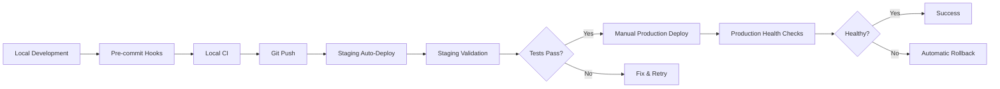

# Deployment Runbook

Complete guide for deploying AINative Next.js application to Railway with validation, health checks, and rollback procedures.

## Table of Contents

1. [Quick Start](#quick-start)
2. [Deployment Pipeline](#deployment-pipeline)
3. [Pre-Deployment Validation](#pre-deployment-validation)
4. [Deployment Procedures](#deployment-procedures)
5. [Post-Deployment Validation](#post-deployment-validation)
6. [Rollback Procedures](#rollback-procedures)
7. [Troubleshooting](#troubleshooting)

---

## Quick Start

### One-Command Deployment

```bash
# Deploy to staging
./scripts/deploy-to-railway.sh staging

# Deploy to production
./scripts/deploy-to-railway.sh production
```

### Manual Step-by-Step

```bash
# 1. Run local CI checks
./scripts/local-ci.sh

# 2. Pre-deployment validation
./scripts/pre-deploy-validation.sh staging

# 3. Deploy
railway up

# 4. Health check
./scripts/health-check.sh https://staging.ainative.studio

# 5. Smoke tests
./scripts/smoke-tests.sh https://staging.ainative.studio
```

---

## Deployment Pipeline

### Development → Staging → Production



### Pre-Commit Validation

Runs automatically on `git commit`:

- ✅ Import validation (all imports resolve to existing files)
- ✅ Environment variable validation
- ✅ Secret detection
- ✅ TypeScript compilation
- ✅ ESLint checks
- ✅ No .env files committed

**Location:** `.git/hooks/pre-commit`

### Local CI Pipeline

Alternative to GitHub Actions when billing is blocked:

```bash
# Full CI pipeline
./scripts/local-ci.sh

# Skip E2E tests (faster)
./scripts/local-ci.sh --skip-e2e

# Skip build (useful for quick checks)
./scripts/local-ci.sh --skip-build
```

**Checks performed:**
1. Linting
2. Type checking
3. Unit tests with coverage
4. Integration tests
5. E2E tests (optional)
6. Production build
7. Security audit

---

## Pre-Deployment Validation

### Required Before Every Deployment

```bash
./scripts/pre-deploy-validation.sh [staging|production]
```

**Validation steps:**

1. **Node.js Version Check**
   - Minimum: v20
   - Ensures compatibility

2. **Package Lock Sync**
   - Validates `package-lock.json` is in sync
   - Prevents dependency mismatches

3. **Dependency Installation**
   - Clean install with `npm ci`
   - Ensures reproducible builds

4. **Environment Variables**
   - Validates all env vars are documented
   - Checks required vars for environment

5. **TypeScript Compilation**
   - Full type check
   - Catches type errors early

6. **Linting**
   - ESLint validation
   - Code quality checks

7. **Unit Tests**
   - All tests must pass
   - Coverage threshold: 80%

8. **Build Verification**
   - Production build test
   - Validates build succeeds

9. **Build Size Check**
   - Monitors bundle size
   - Warns if >200MB

10. **Security Audit**
    - npm audit for vulnerabilities
    - High-severity check

11. **Git Status**
    - Checks for uncommitted changes
    - Validates branch

---

## Deployment Procedures

### Staging Deployment

**Triggers:** Automatic on push to `main` branch

**Manual deployment:**

```bash
./scripts/deploy-to-railway.sh staging
```

**Steps:**
1. Pre-deployment validation runs
2. Git status checked
3. Railway deployment initiated
4. Health checks (5 minutes timeout)
5. Smoke tests
6. Success notification

**Expected URL:** `https://staging.ainative.studio`

**Railway Service:** `AINative-Website-Staging`

### Production Deployment

**Triggers:** Manual only (workflow_dispatch)

**Prerequisites:**
- ✅ All changes tested in staging
- ✅ Stakeholders notified
- ✅ Changelog prepared
- ✅ Rollback plan ready

**Procedure:**

```bash
# 1. Ensure on main branch
git checkout main
git pull origin main

# 2. Run full validation
./scripts/pre-deploy-validation.sh production

# 3. Deploy
./scripts/deploy-to-railway.sh production

# 4. Monitor deployment
railway logs --tail 100

# 5. If successful, tag release
git tag v1.2.3
git push origin v1.2.3
```

**Expected URL:** `https://ainative.studio`

**Railway Service:** `AINative-Website-Production`

### Railway Configuration Files

**Staging:** `railway.toml`
```toml
[deploy]
healthcheckPath = "/api/health"
healthcheckTimeout = 300
restartPolicyType = "on_failure"
restartPolicyMaxRetries = 3
```

**Production:** `railway.production.toml`
```toml
[deploy]
healthcheckPath = "/api/health"
healthcheckTimeout = 600
restartPolicyType = "on_failure"
restartPolicyMaxRetries = 5
replicas = 2
deploymentStrategy = "rolling"

[rollback]
enabled = true
healthCheckFailureThreshold = 3
```

---

## Post-Deployment Validation

### Health Checks

```bash
./scripts/health-check.sh [url] [timeout_seconds]
```

**Example:**
```bash
# Staging
./scripts/health-check.sh https://staging.ainative.studio 300

# Production
./scripts/health-check.sh https://ainative.studio 600
```

**Endpoints tested:**
- `/api/health`
- `/api/v1/health`
- `/`

**Success criteria:**
- HTTP 200, 301, or 302 response
- Response within timeout
- Service responding consistently

### Smoke Tests

```bash
./scripts/smoke-tests.sh [base_url]
```

**Test categories:**

1. **Critical Path Tests**
   - Homepage accessibility
   - API health endpoints
   - Authentication endpoints
   - Static assets (favicon)

2. **Performance Tests**
   - Response time <3000ms
   - Page load metrics

3. **Security Tests**
   - Security headers present
   - SSL/TLS certificate valid
   - HTTPS enforcement

**Success criteria:**
- All critical tests pass
- Performance within acceptable range
- Security headers configured

---

## Rollback Procedures

### Automatic Rollback

Railway automatically rolls back if:
- Health checks fail 3 consecutive times
- Service crashes repeatedly
- Memory/CPU limits exceeded

### Manual Rollback

**Immediate rollback:**

```bash
# Using Railway CLI
railway rollback

# Specific deployment
railway rollback --deployment <deployment-id>
```

**Rollback checklist:**

1. **Identify Issue**
   - Check Railway logs: `railway logs --tail 200`
   - Review error tracking (Sentry)
   - Check health check failures

2. **Decide to Rollback**
   - Critical functionality broken
   - High error rates
   - Security vulnerability

3. **Execute Rollback**
   ```bash
   railway rollback
   ```

4. **Verify Rollback**
   ```bash
   ./scripts/health-check.sh https://ainative.studio
   ./scripts/smoke-tests.sh https://ainative.studio
   ```

5. **Notify Stakeholders**
   - Document the issue
   - Explain rollback reason
   - Provide ETA for fix

6. **Root Cause Analysis**
   - Investigate what failed
   - Fix locally
   - Test in staging
   - Redeploy when ready

### Rollback to Specific Version

```bash
# List deployments
railway deployments

# Rollback to specific deployment
railway rollback --deployment <deployment-id>
```

---

## Troubleshooting

### Deployment Failures

#### Build Fails

**Symptoms:**
- Railway build phase fails
- Missing dependencies error

**Solutions:**
```bash
# 1. Verify package-lock.json is committed
git status package-lock.json

# 2. Re-sync dependencies locally
npm ci
npm run build

# 3. Commit lock file if changed
git add package-lock.json
git commit -m "Fix package-lock.json"
git push
```

#### Missing Environment Variables

**Symptoms:**
- Build succeeds but app crashes on start
- "Missing required env var" errors

**Solutions:**
```bash
# 1. Check Railway env vars
railway variables

# 2. Compare with .env.example
diff <(sort .env.example) <(railway variables | sort)

# 3. Add missing variables
railway variables set NEXT_PUBLIC_API_URL=https://api.ainative.studio

# 4. Redeploy
railway up
```

#### Import Resolution Errors

**Symptoms:**
- "Module not found" errors
- Build fails with import errors

**Solutions:**
```bash
# 1. Run import validation locally
node scripts/validate-imports.js

# 2. Fix import paths
# 3. Verify file exists
# 4. Commit and redeploy
```

### Health Check Failures

#### Timeout Errors

**Symptoms:**
- Health check times out after 5 minutes
- App is starting slowly

**Solutions:**
```bash
# 1. Check Railway logs for startup errors
railway logs --tail 100

# 2. Verify database connections
# 3. Check for blocking initialization code
# 4. Increase timeout in railway.toml if needed
```

#### 502/503 Errors

**Symptoms:**
- Health check returns 502 or 503
- Service unavailable

**Solutions:**
```bash
# 1. Check if service is running
railway status

# 2. Review logs for crashes
railway logs --tail 200

# 3. Check memory/CPU usage
railway metrics

# 4. Verify start command in railway.toml
```

### Post-Deployment Issues

#### High Error Rates

**Actions:**
```bash
# 1. Check Sentry for error patterns
# 2. Review Railway logs
railway logs --tail 500

# 3. Run smoke tests to identify failing endpoints
./scripts/smoke-tests.sh https://ainative.studio

# 4. If critical, rollback immediately
railway rollback
```

#### Slow Performance

**Actions:**
```bash
# 1. Check response times
./scripts/smoke-tests.sh https://ainative.studio

# 2. Review Railway metrics
railway metrics

# 3. Check database performance
# 4. Review recent code changes for performance impact
```

#### Security Vulnerabilities

**Actions:**
```bash
# 1. Run security audit
npm audit --audit-level=high

# 2. Update vulnerable packages
npm audit fix

# 3. Test locally
npm run test:all
npm run build

# 4. Deploy hotfix
./scripts/deploy-to-railway.sh production
```

---

## Emergency Procedures

### Production is Down

**Immediate Actions:**

1. **Verify outage**
   ```bash
   curl -I https://ainative.studio
   railway status
   ```

2. **Check Railway status**
   ```bash
   railway logs --tail 100
   railway metrics
   ```

3. **Attempt automatic recovery**
   ```bash
   railway restart
   ```

4. **If restart fails, rollback**
   ```bash
   railway rollback
   ```

5. **Verify recovery**
   ```bash
   ./scripts/health-check.sh https://ainative.studio
   ```

6. **Notify stakeholders**
   - Status page update
   - Customer communication
   - Internal team notification

### Database Connection Issues

**Symptoms:**
- "Too many clients" errors
- Connection pool exhausted

**Solutions:**
```bash
# 1. Check database pool status
python3 scripts/check_db_connection_pool.py

# 2. Kill rogue connections
# 3. Restart application
railway restart

# 4. Monitor connection usage
# 5. Adjust pool size if needed
```

---

## Monitoring and Alerts

### Key Metrics to Monitor

1. **Deployment Success Rate**
   - Target: >95%
   - Track failed deployments

2. **Health Check Response Time**
   - Target: <2s
   - Alert if >5s

3. **Error Rate**
   - Target: <0.1%
   - Alert if >1%

4. **Build Time**
   - Target: <5 minutes
   - Optimize if >10 minutes

5. **Rollback Frequency**
   - Target: <5% of deployments
   - Investigate patterns

### Railway Logs

```bash
# Tail logs
railway logs --tail 100

# Filter by level
railway logs --level error

# Export logs
railway logs > deployment.log
```

### Sentry Integration

- Error tracking enabled in production
- Alert thresholds configured
- Integration with Slack for critical errors

---

## Best Practices

### Before Every Deployment

- [ ] Run `./scripts/local-ci.sh`
- [ ] Test in staging first
- [ ] Review all code changes
- [ ] Check for breaking changes
- [ ] Verify environment variables
- [ ] Prepare rollback plan

### During Deployment

- [ ] Monitor Railway logs
- [ ] Watch health check progress
- [ ] Have rollback ready
- [ ] Communicate with team

### After Deployment

- [ ] Run smoke tests
- [ ] Monitor error rates
- [ ] Check performance metrics
- [ ] Verify critical features
- [ ] Document any issues
- [ ] Tag successful releases

### Never

- ❌ Deploy without testing in staging
- ❌ Deploy during peak traffic hours (production)
- ❌ Ignore failing tests
- ❌ Skip pre-deployment validation
- ❌ Deploy with uncommitted changes
- ❌ Commit secrets or .env files

---

## Scripts Reference

### Location

All deployment scripts are in `/Users/aideveloper/core/AINative-website-nextjs/scripts/`

### Available Scripts

| Script | Purpose | Usage |
|--------|---------|-------|
| `local-ci.sh` | Local CI pipeline | `./scripts/local-ci.sh [--skip-e2e]` |
| `pre-deploy-validation.sh` | Pre-deployment checks | `./scripts/pre-deploy-validation.sh [env]` |
| `deploy-to-railway.sh` | Complete deployment | `./scripts/deploy-to-railway.sh [env]` |
| `health-check.sh` | Health verification | `./scripts/health-check.sh [url] [timeout]` |
| `smoke-tests.sh` | Post-deploy tests | `./scripts/smoke-tests.sh [url]` |
| `validate-imports.js` | Import validation | `node scripts/validate-imports.js` |
| `validate-env-vars.js` | Env var validation | `node scripts/validate-env-vars.js` |

### Pre-Commit Hook

**Location:** `.git/hooks/pre-commit`

**Automatically runs on commit:**
- Import validation
- Environment variable checks
- Secret detection
- TypeScript compilation
- Linting

**To bypass (emergency only):**
```bash
git commit --no-verify
```

---

## Contact and Escalation

### For Deployment Issues

1. Check this runbook first
2. Review Railway logs
3. Check Sentry for errors
4. Escalate if unresolved in 30 minutes

### Emergency Contacts

- **DevOps Lead:** [Contact info]
- **On-Call Engineer:** [Contact info]
- **Railway Status:** https://railway.app/status

---

## Changelog

| Date | Version | Changes |
|------|---------|---------|
| 2026-02-08 | 1.0.0 | Initial deployment runbook created |

---

## Related Documentation

- [Railway Troubleshooting Guide](./RAILWAY_TROUBLESHOOTING.md)
- [Kong Deployment Guide](./KONG_DEPLOYMENT_GUIDE.md)
- [Environment Configuration](.env.example)
- [GitHub Actions CI](.github/workflows/ci.yml)
