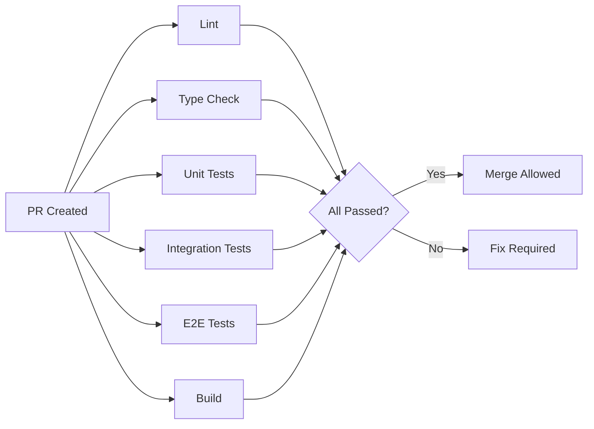
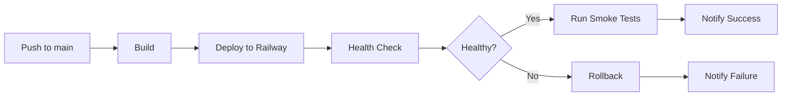
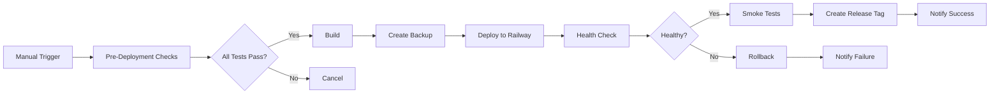

# DevOps Documentation

## Overview

This directory contains comprehensive DevOps documentation for the AINative Studio Next.js application, covering CI/CD pipelines, deployment strategies, monitoring, and operational procedures.

## Documentation Index

### 1. [Git Workflow Guide](./git-workflow.md)
Complete guide to Git workflow, branching strategy, and commit standards.

**Key Topics:**
- Branch naming conventions
- Commit message standards (ZERO TOLERANCE for AI attribution)
- Pull request workflow
- Code review checklist
- Hotfix procedures

**Quick Reference:**
```bash
# Create feature branch
git checkout -b feature/issue-123-add-dashboard

# Commit with proper message
git commit -m "Add dashboard analytics feature

- Implement real-time analytics charts
- Add data filtering and export
- Integrate with backend API
- Add comprehensive test coverage"

# Create PR
gh pr create --title "Add dashboard analytics" --body-file pr-template.md
```

### 2. [Deployment Guide](./deployment-guide.md)
Step-by-step deployment procedures for staging and production environments.

**Key Topics:**
- Pre-deployment checklist
- Staging deployment (automatic)
- Production deployment (manual)
- Rollback procedures
- Environment variables management
- Database migrations
- Health checks and verification

**Quick Reference:**
```bash
# Deploy to staging (automatic on push to main)
git push origin main

# Deploy to production (manual trigger)
# Via GitHub Actions workflow with version tag

# Rollback if needed
railway rollback --service production-ainative-nextjs
```

### 3. [Runbook](./runbook.md)
Operational runbook for incident response and maintenance procedures.

**Key Topics:**
- Emergency contacts
- Common incident scenarios
- Troubleshooting procedures
- Maintenance procedures
- Monitoring and alerts
- Post-incident reviews

**Quick Reference:**
```bash
# Health check
curl https://ainative.studio/api/health

# View logs
railway logs --service production-ainative-nextjs

# Restart service
railway restart --service production-ainative-nextjs
```

### 4. [Environment Variables](./environment-variables.md)
Complete guide to environment variable configuration and management.

**Key Topics:**
- Required variables
- Optional variables
- Environment-specific configuration
- Secret management
- Security best practices
- Validation and troubleshooting

**Quick Reference:**
```bash
# Set environment variable
railway variables set KEY=value --service production-ainative-nextjs

# List all variables
railway variables --service production-ainative-nextjs

# Copy .env.example for local development
cp .env.example .env.local
```

### 5. [Build Optimization](./build-optimization.md)
Strategies and tools for optimizing build size and performance.

**Key Topics:**
- Bundle analysis
- Code splitting strategies
- Tree shaking
- Image optimization
- Dependency optimization
- Performance monitoring
- Size thresholds

**Quick Reference:**
```bash
# Analyze bundle
npm run build:analyze

# Custom bundle analysis
npm run bundle:analyze

# Run Lighthouse audit
npm run lighthouse
```

## CI/CD Pipeline

### Overview

The CI/CD pipeline is implemented using GitHub Actions with separate workflows for:
- Continuous Integration (PR validation)
- Staging deployment (automatic)
- Production deployment (manual)

### Pipeline Stages

#### 1. Pull Request Validation (`.github/workflows/ci.yml`)

Runs on every pull request to `main` branch:



**Jobs:**
- **Lint**: ESLint validation
- **Type Check**: TypeScript type checking
- **Unit Tests**: Jest unit tests with 80%+ coverage
- **Integration Tests**: API integration tests
- **E2E Tests**: Playwright end-to-end tests
- **Build**: Next.js production build
- **Bundle Analysis**: Bundle size analysis (PR only)
- **Security Scan**: npm audit and Snyk scan

#### 2. Staging Deployment (`.github/workflows/cd-staging.yml`)

Runs automatically on push to `main` branch:



**Steps:**
1. Checkout code
2. Install dependencies
3. Build application
4. Deploy to Railway staging
5. Wait for deployment
6. Run health checks
7. Run smoke tests
8. Notify team (Slack)

#### 3. Production Deployment (`.github/workflows/cd-production.yml`)

Manual trigger with version tag input:



**Steps:**
1. Run all tests
2. Security audit
3. Build verification
4. Create backup
5. Deploy to Railway production
6. Health checks (10 attempts)
7. Smoke tests
8. Create release tag
9. Notify team (Slack)
10. Auto-rollback on failure

## Pre-Commit Hooks

### Husky Configuration

Pre-commit hooks automatically run before each commit:

**Hook: `pre-commit`**
1. Run lint-staged (ESLint + Prettier)
2. TypeScript type checking
3. Run tests with coverage (80%+ required)
4. Check coverage threshold
5. Build verification

**Hook: `commit-msg`**
1. Validate commit message format
2. Check for forbidden AI attribution
3. Enforce minimum message length
4. Warn on long title lines

### Bypassing Hooks (Use with Caution)

```bash
# Skip pre-commit hook (NOT RECOMMENDED)
git commit --no-verify -m "Emergency fix"

# Only use for:
# - Emergency hotfixes
# - Work-in-progress commits
# - Temporary fixes
```

## Quick Start Commands

### Development

```bash
# Start development server
npm run dev

# Run with clean cache
rm -rf .next && npm run dev

# Reclaim port 3000
pkill -f "next" && npm run dev
```

### Testing

```bash
# Run all tests
npm run test:all

# Run unit tests with coverage
npm run test:coverage

# Run E2E tests
npm run test:e2e

# Run E2E tests in UI mode
npm run test:e2e:ui
```

### Build and Verification

```bash
# Full verification (pre-commit equivalent)
npm run verify

# Build application
npm run build

# Analyze bundle
npm run build:analyze

# Run Lighthouse audit
npm run lighthouse
```

### Deployment

```bash
# Deploy to staging (via git push)
git push origin main

# Deploy to production (via GitHub Actions)
# Go to Actions → Deploy to Production → Run workflow

# Manual deployment via Railway CLI
railway up --service staging-ainative-nextjs
railway up --service production-ainative-nextjs
```

## Monitoring and Alerts

### Health Checks

```bash
# Production
curl https://ainative.studio/api/health

# Staging
curl https://staging.ainative.studio/api/health
```

### Logs

```bash
# View production logs
railway logs --service production-ainative-nextjs

# View staging logs
railway logs --service staging-ainative-nextjs

# Follow logs in real-time
railway logs --service production-ainative-nextjs --follow
```

### Metrics

Monitor via Railway Dashboard:
- CPU usage
- Memory usage
- Request rate
- Response time
- Error rate

## Emergency Procedures

### Site Down

```bash
# 1. Check health
curl -I https://ainative.studio/api/health

# 2. Check logs
railway logs --service production-ainative-nextjs --tail 100

# 3. Rollback if recent deployment
railway rollback --service production-ainative-nextjs

# 4. Restart if needed
railway restart --service production-ainative-nextjs
```

### Rollback Deployment

```bash
# Via Railway CLI
railway rollback --service production-ainative-nextjs

# Via GitHub Actions
# Run "Deploy to Production" workflow with previous version tag
```

### Database Issues

```bash
# Check database status
railway run --service production-ainative-nextjs -- npm run db:status

# Restart to reset connections
railway restart --service production-ainative-nextjs
```

## Security Best Practices

### Secrets Management

- ✅ Store secrets in Railway environment variables
- ✅ Use different secrets for staging and production
- ✅ Rotate secrets every 90 days
- ✅ Use strong random generation
- ❌ Never commit secrets to git
- ❌ Never hardcode secrets in code

### Access Control

- Limit Railway project access to necessary team members
- Use GitHub branch protection rules
- Require PR reviews before merge
- Enable two-factor authentication
- Audit access logs regularly

### Dependency Security

```bash
# Check for vulnerabilities
npm audit

# Fix automatically
npm audit fix

# Manual fixes for critical issues
npm update [package-name]
```

## Performance Targets

### Bundle Size Targets

| Metric | Target | Threshold |
|--------|--------|-----------|
| Total JS Size | < 400 KB | 500 KB |
| First Load JS | < 250 KB | 300 KB |
| Route Size | < 40 KB | 50 KB |
| Shared Chunk | < 80 KB | 100 KB |

### Lighthouse Scores

| Metric | Target | Minimum |
|--------|--------|---------|
| Performance | 95+ | 90 |
| Accessibility | 98+ | 95 |
| Best Practices | 98+ | 95 |
| SEO | 100 | 100 |

### Core Web Vitals

| Metric | Target | Maximum |
|--------|--------|---------|
| LCP | < 2.0s | 2.5s |
| FID | < 50ms | 100ms |
| CLS | < 0.05 | 0.1 |

## Support and Escalation

### On-Call Schedule

Check #on-call Slack channel for current on-call engineer

### Escalation Path

1. **On-call Engineer** - First response
2. **Engineering Lead** - Technical escalation
3. **CTO** - Critical incidents only

### Communication Channels

- **Slack**: #deployments, #engineering, #incidents
- **Email**: engineering@ainative.studio
- **Emergency**: Check team wiki for phone contacts

## Contributing

### Adding New Documentation

1. Create new markdown file in `docs/devops/`
2. Add entry to this README index
3. Update relevant workflows if needed
4. Submit PR with documentation changes

### Updating Workflows

1. Edit `.github/workflows/*.yml`
2. Test changes in feature branch
3. Document changes in PR description
4. Get approval from DevOps team
5. Monitor first run after merge

## Resources

### External Documentation

- [Next.js Deployment](https://nextjs.org/docs/deployment)
- [Railway Documentation](https://docs.railway.app/)
- [GitHub Actions](https://docs.github.com/en/actions)
- [Husky Documentation](https://typicode.github.io/husky/)
- [Lighthouse CI](https://github.com/GoogleChrome/lighthouse-ci)

### Internal Resources

- Team Wiki: [Internal Link]
- Slack Channels: #deployments, #engineering
- Project Board: [GitHub Projects Link]
- Monitoring Dashboard: [Railway Dashboard]

## Changelog

### 2026-01-29
- Initial DevOps documentation created
- CI/CD pipelines configured
- Pre-commit hooks implemented
- Deployment guides added
- Environment variable documentation
- Build optimization guide
- Runbook for incident response
